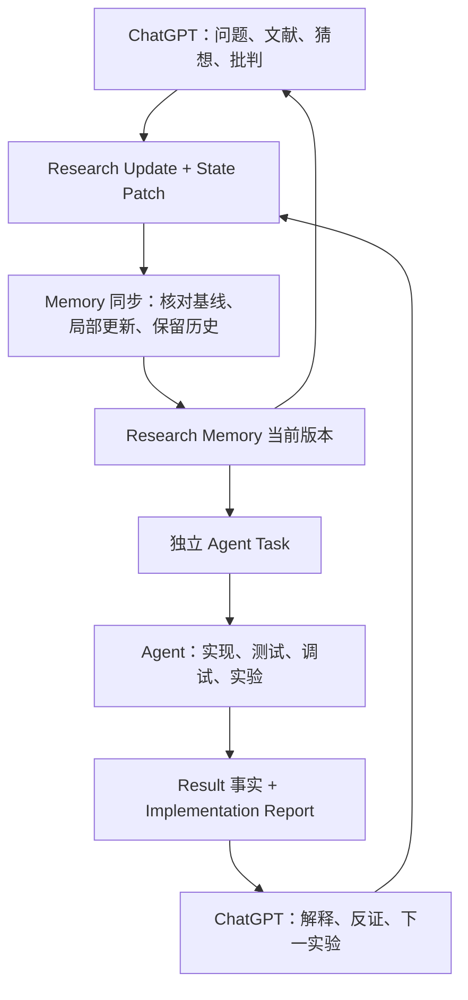

# Research Memory 工作区

将科研讨论、当前研究依据、工程执行与实验反馈接成可追溯的循环。此目录可复制到科研代码仓库；目前尚未指定真实课题、假设或实验。

## 文件职责

| 文件 / 目录 | 保存什么 | 更新方式 |
| --- | --- | --- |
| `RESEARCH_STATE.md` | 当前方向、事实、活动假设、实验与下一步 | 根据 Update 局部修改，保持 1–3 页 |
| `updates/` | 每次讨论产生的变化与依据 | 已应用记录只追加修正，不覆盖 |
| `DECISIONS.md` | 为什么选择、放弃或改变方向 | 新决策指向被替代的决策 |
| `IDEA_POOL.md` | 猜想、候选、搁置及拒绝原因 | 选中的内容才提升到 State |
| `LITERATURE.md`、`literature/` | 文献索引、证据卡及其研究用途 | 保留支持和反对的材料 |
| `HYPOTHESES.md` | 科学命题、证据与状态历史 | 保留 Previous / New / Reason |
| `OPEN_QUESTIONS.md` | 未解决问题与解决条件 | 新增或记录关闭事件 |
| `experiments/` | 可证伪的设计、对照、阈值、消融、预算 | 运行前固定版本 |
| `results/` | 原始运行事实、指标与溯源 | 每次运行单独目录 |
| `analyses/` | 解释、竞争解释与假设评估 | 与结果事实分开 |
| `agent_tasks/` | 可执行、可验收的工程任务 | 绑定 State 与实验版本 |
| `reports/` | 实现、测试、偏离与交接报告 | 按任务和执行批次保存 |
| `prompts/`、`templates/` | 固定指令与记录格式 | 流程资产，不是科研证据 |

## 第一次使用

1. 阅读 [协议](RESEARCH_AGENT_PROTOCOL.md)，把 [ChatGPT 项目指令](prompts/CHATGPT_PROJECT.md) 放入科研项目的指令中。
2. 运行 `python3 tools/research_memory.py export`，上传生成的 `exports/context-*.md` 到 ChatGPT。当前使用文件往返，尚未配置云端自动同步。
3. 用 [首次定题指令](prompts/BOOTSTRAP.md) 提供真实课题、研究对象、baseline、数据和资源限制。未知内容保持未知。
4. 讨论结束发送下面的固定指令，把输出的 Update 和独立文件草稿暂存到 inbox/；文件中保留最终目标路径，核对基线后再合并到正式目录。
5. 本地使用 [Memory 同步指令](prompts/MEMORY_SYNC.md) 落实增量变化、核对引用并重新导出上下文。
6. 独立任务满足 Ready 条件后，使用 [Agent 执行指令](prompts/Agent_EXECUTE.md)。运行结束后使用 [结果复盘指令](prompts/RESULT_REVIEW.md)。

固定结束指令：

> 本次 Research Discussion 结束。请按项目中的 Research Agent Protocol 收敛本次增量：输出 Research Update、精确的 State Patch 和受影响记录；有可执行工程需求时另生成独立 Agent Task。保留证据、反证、不确定性与被否定方案，不重写完整 State，不重复无变化内容；未决定或缺少执行条件的事项保持 Pending / Draft。使用本次上下文中的基线版本与文件指纹，不猜测缺失内容。

完整版本见 [END_DISCUSSION](prompts/END_DISCUSSION.md)。新对话必须提供协议及最新上下文；单独一句话无法传递这些内容。

## 日常闭环



Memory 同步与工程执行是两个角色，可以由同一个本地 Agent 分两次完成。同步角色处理更新文档；工程角色接收明确的独立任务，Research Update 本身不是工程规格。

## 辅助命令

inbox/ 保存待合并草稿，不进入当前 Memory、基线清单或就绪检查。完成合并后保留或移走草稿均可，正式记录以 updates/ 与专题文件为准。

仅依赖 Python 3.10+ 标准库，不调用模型、不联网、不执行实验。

```bash
python3 tools/research_memory.py check
python3 tools/research_memory.py fingerprint
python3 tools/research_memory.py export
python3 tools/research_memory.py export --include experiments/EXP-001.md --include agent_tasks/TASK-001.md
python3 tools/research_memory.py verify-base exports/manifest-<bundle-id>.json
python3 tools/research_memory.py check --ready agent_tasks/TASK-001.md
python3 -m unittest discover -s tests -v
```

`export` 生成可上传 Markdown 和 SHA256 文件清单。默认包含协议、模板、State 与记忆索引，并递归收集它们引用的科研 Markdown。代码、数据与原始日志不自动打包；额外文档用 `--include` 指定。文件清单也嵌入上下文，便于 GPT 原样引用指纹。

`verify-base` 在修改前核对清单中的全部文件和科研记录目录清单，拒绝过期快照。自然语言变更由本地维护者按 Before → After 合并，脚本不自动解释、应用或决策。`check` 只检查科研工作区的文档，不扫描代码仓库中无关的文档；检查大小、结构与本地文件引用，不校验 Markdown 的段内锚点；`--ready` 额外检查执行规格、占位符、State 指纹及实验版本。脚本无法判断证据真假、统计合理性或科学结论。

建议每次合并后用 Git 提交 Update、关联记录与 State，任务实现也保留代码版本。这里未自动初始化 Git 或创建提交。复制到已有仓库时合并原有 `AGENTS.md` 和 `.gitignore`，保留其项目规则。

## 共享边界

本地文件是唯一权威副本，ChatGPT 上传文件是讨论快照。普通 ChatGPT 项目需上传或连接来源，不能据此假设它会自动写回本地目录。[OpenAI 官方项目文档](https://learn.chatgpt.com/zh-Hans/docs/projects?surface=app)

`AGENTS.md` 指示 Agent 首先读取 State，然后读取 Task 的 Context；文件名本身不会自动完成共享。[OpenAI 官方 AGENTS.md 文档](https://learn.chatgpt.com/docs/agent-configuration/agents-md)

将来采用连接器或 MCP 时，保留相同的版本校验与写入协议。读取文件、拥有写权限、写入成功应分别验证。

完整虚构演示见 [WALKTHROUGH](examples/WALKTHROUGH.md)，不属于当前科研记忆。
